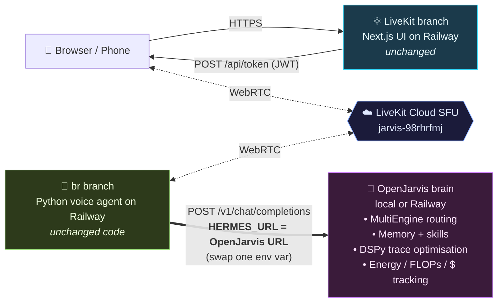

# 🤖 Branch Comparison — `br` ↔ `LiveKit`

> 💡 **TL;DR** — These aren't competing implementations. They're **two halves of the same product**: `br` is the *voice* (Python agent worker), `LiveKit` is the *face* (Next.js UI). They never call each other directly — they meet inside a LiveKit Cloud room.

---

## 🗺️ The architecture at a glance

```text
   📱 Browser / Phone
          │
          │  HTTPS                  ┌──────────────────────────────┐
          ├────────────────────────►│  ⚛️  LiveKit branch          │
          │                         │     Next.js 15 UI            │
          │   ◄── WebRTC (audio,    │     • POST /api/token (JWT)  │
          │       video, data) ────►│     • WebRTC client          │
          │                         │     • Service B on Railway   │
          │                         └──────────────┬───────────────┘
          │                                        │ mints JWT for
          │                                        │ project
          │                                        ▼
          │                  ┌──────────────────────────────────┐
          ├─────WebRTC──────►│  ☁️  LiveKit Cloud SFU            │
          │                  │     wss://jarvis-98rhrfmj…       │
          │                  └──────────────┬───────────────────┘
          │                                 │ auto-dispatch
          │                                 ▼
          │                  ┌──────────────────────────────────┐
          └────WebRTC───────►│  🐍  br branch                   │
                             │     Python voice agent           │
                             │     • livekit-agents worker      │
                             │     • STT → Hermes LLM → TTS     │
                             │     • Service A on Railway       │
                             └──────────────┬───────────────────┘
                                            │ HTTPS  /v1
                                            ▼
                             ┌──────────────────────────────────┐
                             │  🧠  Hermes service              │
                             │     (separate Railway service)   │
                             └──────────────────────────────────┘
```

---

## 📊 Side-by-side cheat sheet

| 🔍 Aspect | 🐍 `br` branch | ⚛️ `LiveKit` branch |
|---|---|---|
| 🎭 **Role** | Voice agent worker | Frontend + JWT minter |
| 💻 **Language** | Python 3.11 | TypeScript + React 19 |
| 📦 **Framework** | `livekit-agents` (Python SDK) | Next.js 15 (App Router) |
| 🚪 **Entry point** | `agent.py` → `agents.cli.run_app(...)` | `app/page.tsx` + `app/api/token/route.ts` |
| ⏳ **Process model** | Long-lived worker, room-per-job | Stateless HTTP, request-per-token |
| 🌐 **Public port** | ❌ none (outbound WS only) | ✅ `:3000` (Railway-assigned domain) |
| 🐳 **Container base** | `python:3.11-slim` (single-stage) | `node:20-alpine` (3-stage standalone) |
| 🏗️ **Build steps** | `pip install` + VAD pre-download | `pnpm install` → `pnpm build` → copy `.next/standalone` |
| ❄️ **Cold start** | Slower (Silero VAD load) | Faster (alpine + standalone server.js) |
| 🧠 **LLM** | ✅ `openai.LLM` → Hermes (`hermes-agent`) | ❌ none — UI never calls an LLM |
| 🎤 **STT** | ✅ Deepgram → Google fallback | ❌ none |
| 🔊 **TTS** | ✅ Google Cloud → Deepgram fallback (low-latency Aura) | ❌ none |
| 👂 **VAD** | ✅ Silero, prewarmed per worker process | ❌ n/a |
| 🛡️ **Noise cancel** | ✅ LiveKit BVC plugin | ❌ n/a |
| 🧭 **Agent dispatch** | Implicit — no `agent_name`, auto-dispatched | Mints token only; no dispatch logic |
| 🆔 **Session ID** | `ctx.room.name` → `X-Hermes-Session-Id` header | Random `voice_assistant_room_<n>` per click |
| 🔑 **Required env** | `LIVEKIT_*`, `HERMES_URL`, `HERMES_API_KEY`, `N8N_MCP_SERVER_URL?` | `LIVEKIT_URL`, `LIVEKIT_API_KEY`, `LIVEKIT_API_SECRET` |
| 💥 **Common failure** | "Connection error" when `HERMES_URL=localhost` | 500 on `/api/token` if `LIVEKIT_*` unset |
| ⚡ **Latency lever** | TTS provider (Deepgram Aura), VAD prewarm | `output:'standalone'`, preconnect buffer |
| 🔁 **Restart policy** | `on_failure`, retry 5× | `on_failure`, retry 5× |
| 🚢 **Railway service** | Service A (worker) | Service B (web) |

---

## 🐍 The `br` branch — the voice

### 📂 Code
A small Python file (`agent.py`, ~95 lines) wires LiveKit Agents to the STT/LLM/TTS stack. Personality lives in `prompts.py`. Optional `hermes_adapter.py` is a tiny HTTP client (kept around for non-LiveKit callers).

```python
session = AgentSession(
    vad=ctx.proc.userdata["vad"],       # Silero, prewarmed
    stt=stt,                             # Deepgram → Google
    llm=openai.LLM(                     # Hermes (OpenAI-compatible)
        model="hermes-agent",
        base_url=f"{hermes_url}/v1",
        api_key=hermes_key,
        extra_headers={"X-Hermes-Session-Id": ctx.room.name},
    ),
    tts=tts,                             # Google → Deepgram
)
```

### 🏗️ Infrastructure
- 🐳 **Dockerfile** pre-downloads the Silero VAD model at build time so worker boot doesn't pay for it.
- 🚂 **Railway** runs `python agent.py start` as a long-lived worker — **no port exposed**, no inbound HTTP.
- 🌍 **Networking** is purely outbound WebSocket to LiveKit Cloud + outbound HTTPS to Hermes/Deepgram/Google.

### 🧠 LLM + model handling
- Speaks to Hermes via the **OpenAI Chat Completions wire format** (Hermes exposes `/v1/...`).
- The model identifier `"hermes-agent"` is a *route key* on the Hermes side, not a literal model name — Hermes does its own routing/fallback to underlying providers.
- One LiveKit room → one Hermes session. The `X-Hermes-Session-Id` header pins memory/state.

### 👷 Worker handling
- `agents.cli.run_app(WorkerOptions(entrypoint_fnc, prewarm_fnc))` registers a **worker** with LiveKit Cloud.
- LiveKit Cloud auto-dispatches the worker into any new room (no `agent_name` set ⇒ automatic dispatch).
- `prewarm_fnc` loads heavy stuff (VAD) once per process; `entrypoint_fnc` runs per room.
- Worker is restart-on-failure (up to 5×).

### ✅ Pros
- 🎯 Tight, focused — one file does the voice loop.
- 🧘 Stateless from LiveKit's POV: any worker can pick up any room.
- 🔁 Provider-agnostic STT/TTS chains with graceful fallback.
- 💸 No public port → smaller attack surface, no CDN/edge needed.

### ⚠️ Cons / gotchas
- 🚨 `HERMES_URL=http://localhost:8642` is the committed default — **you MUST override it on Railway** to the internal `hermes-agent.railway.internal:<port>` URL, or every LLM call fails with `Connection error`.
- 🐢 Cold start carries the Silero VAD load even with build-time prewarm caching.
- 🧪 No HTTP healthcheck possible (no port) — you debug from Deploy Logs.
- 🔇 `unpinned livekit-agents` in `requirements.txt` — fresh builds can drift; pin if you need reproducibility.

---

## ⚛️ The `LiveKit` branch — the face

### 📂 Code
A Next.js 15 App Router app (the LiveKit `agent-starter-react` fork) rebranded as **Friday**: arc-reactor logo (`public/arc-reactor.svg`), CSS/SVG animated HUD background (`components/app/jarvis-hud-background.tsx`), forced dark theme, "Talk to Friday" CTA. UI behavior is configured in `app-config.ts`. The only server-side route is `app/api/token/route.ts`:

```ts
const at = new AccessToken(API_KEY, API_SECRET, {
  identity: participantIdentity,
  name: 'user',
  ttl: '15m',
});
at.addGrant({ room, roomJoin: true, canPublish: true,
              canPublishData: true, canSubscribe: true });
return NextResponse.json({ serverUrl, roomName, participantName, participantToken });
```

### 🏗️ Infrastructure
- 🐳 **Multi-stage Dockerfile** (alpine): `deps → build → runtime`. Runtime copies `.next/standalone` + `.next/static` + `public`, runs as non-root, `CMD ["node","server.js"]`.
- ⚙️ `next.config.ts` uses `output: 'standalone'` → minimal image, fast cold start.
- 📄 `.gitattributes` pins LF so Windows checkouts don't break the Prettier lint gate.
- 🚂 **Railway** exposes port 3000 (`PORT` env honored).

### 🧠 LLM + model handling
- **Nothing.** This branch never calls a language model. It only:
  1. Mints short-lived JWTs (`AccessToken`, 15-min TTL) using the LiveKit server SDK.
  2. Renders the WebRTC client.
- All "intelligence" lives in the `br` agent on the other side of the SFU.

### 👷 Worker handling
- **No worker concept.** Each `POST /api/token` is independent and stateless.
- No persistent connection from the Next.js server to LiveKit — the *browser* opens WebRTC to the SFU.
- "Automatic dispatch" here just means *don't put an agent name in the token's `RoomConfiguration`* — leave `AGENT_NAME` blank in env, and LiveKit Cloud assigns whichever worker is registered to the project.

### ✅ Pros
- 🎨 Fully customisable, beautiful UI without touching the agent.
- 🌍 Public URL → reachable from any device (phone test in the tutorial works directly).
- ⚡ Browser ↔ SFU media path is WebRTC; the Next.js server is only on the *control* path (token), not the audio path.
- 🧊 Stateless / horizontally scalable — add replicas to handle more token-mints.

### ⚠️ Cons / gotchas
- 🔓 The token route is **unauthenticated** — anyone who can hit `/api/token` can join. Fine for a demo / shared link, but add an auth layer before exposing publicly.
- 🪟 Without `.gitattributes` enforcing LF, Windows contributors get CRLF on checkout and `next build` fails Prettier (already fixed on this branch).
- 🧬 Frontend feature drift: `agent-starter-react` evolves quickly; the agent's `livekit-agents` SDK must stay current to register handlers for newer text-stream topics (`lk.agent.request`, `lk.chat`, etc.).
- ❌ Cannot test end-to-end without a running `br` worker on the **same** LiveKit project.

---

## 🔗 How they meet (the rendezvous)

1. Browser hits Service B → `POST /api/token` → JWT for project `jarvis-98rhrfmj`, random room name.
2. Browser opens WebRTC to LiveKit Cloud using that JWT.
3. LiveKit Cloud sees a participant joined and **auto-dispatches** any worker registered to the project (that's Service A on `br`).
4. The agent worker joins the room, runs the STT → LLM → TTS loop, publishes audio back to the SFU.
5. The browser hears the agent. The agent hears the browser. Neither ever called the other's URL.

The **only shared contract** is the LiveKit project: `LIVEKIT_URL`, `LIVEKIT_API_KEY`, `LIVEKIT_API_SECRET` must match across both services.

---

## 🎯 When to edit which

| You want to change… | Touch the branch… |
|---|---|
| 🗣️ Voice personality, jokes, refusals | 🐍 `br` (`prompts.py`) |
| 🛠️ Tools the agent can call | 🐍 `br` (`agent.py` + MCP) |
| 🎚️ TTS / STT provider / voice | 🐍 `br` (`agent.py`) |
| 🧠 Which LLM / Hermes route | 🐍 `br` (env: `HERMES_URL`) |
| 🎨 Branding, logo, animations, theme | ⚛️ `LiveKit` (`app-config.ts`, `components/app/*`) |
| 🔐 Auth on the token endpoint | ⚛️ `LiveKit` (`app/api/token/route.ts`) |
| 📱 PWA / camera / chat UI | ⚛️ `LiveKit` (`components/agents-ui/*`) |
| 🔑 LiveKit credentials | 🤝 **Both** (must match) |
| 🚀 Deploy region / cold-start tuning | 🤝 **Both** (co-locate for minimum RTT) |

---

## 🧪 Quick "is it wired up?" checklist

- [ ] 🐍 `br` service Railway logs show `registered worker` (not just `failed to connect…`).
- [ ] 🐍 `br` env has `HERMES_URL` pointing at Hermes (NOT `localhost`).
- [ ] ⚛️ `LiveKit` service `POST /api/token` returns **200** with a JWT (not the old "INSECURE" 500).
- [ ] 🤝 Both services share the same `LIVEKIT_URL` / `LIVEKIT_API_KEY` / `LIVEKIT_API_SECRET`.
- [ ] 🌍 Both services in the same Railway region (latency).
- [ ] 🗣️ Open the UI, click **Talk to Friday**, hear a reply within ~1–2 s.

---

# 🏛️ Zoom out — `friday_jarvis2` vs the entire `OpenJarvis` project

> 🌐 The previous sections compared `br` to `LiveKit` (two halves of *one* product).
> This section compares the **whole** `friday_jarvis2` (br + LiveKit together) against
> **[gelson12/OpenJarvis](https://github.com/gelson12/OpenJarvis/tree/livekit)** — Stanford
> Hazy Research / Scaling Intelligence Lab's local-first AI framework (the "PyTorch of
> personal AI"). Different in **kind**: friday_jarvis2 is a **focused product**,
> OpenJarvis is a **platform**.

## 🎴 The contenders — ID cards

```text
╭───────────────────────────────────────╮   ╭───────────────────────────────────────╮
│ 🤖 friday_jarvis2                     │   │ 🧠 OpenJarvis                         │
│ ─────────────────────                 │   │ ─────────────────────                 │
│ 🎯 "Jarvis voice agent in a weekend" │   │ 🎯 "Personal AI, on personal devices" │
│ 👤 Solo personal fork                 │   │ 🏛️ Stanford SAIL / Hazy Research      │
│ 📅 Tutorial-grade (2026)              │   │ 📚 Research-grade framework           │
│ 📦 Python + TypeScript                │   │ 📦 Python + Rust + TS + Shell         │
│ 📏 ~Hundreds of LOC                   │   │ 📏 ~10 MB across 30+ subsystems       │
│ 🚂 Deploy: 2× Railway                 │   │ 🚂 Deploy: Docker+nginx+supervisord   │
│ 🎤 Surface: voice + web               │   │ 🎤 Surface: voice+CLI+desktop+chat    │
│ 🧠 Brain: remote Hermes               │   │ 🧠 Brain: local-first MultiEngine     │
│ 🎓 Curve: 📈 low                      │   │ 🎓 Curve: 📈📈📈 high                  │
│ 💸 Cost: per-API-call                 │   │ 💸 Cost: free-at-edge + overflow      │
│ 🪫 Energy-aware? ❌                   │   │ 🪫 Energy-aware? ✅ first-class       │
│ 🌱 Self-learning? ❌ (none in repo)   │   │ 🌱 Self-learning? ✅ DSPy trace-loop  │
╰───────────────────────────────────────╯   ╰───────────────────────────────────────╯
```

> 💬 **In one line each:**
> 🤖 *friday_jarvis2 is a really nice voice handle wrapped around someone else's brain.*
> 🧠 *OpenJarvis is the brain — and the lab, and the gym, and the dojo.*

## 📊 Strength scorecard (out of 10)

```text
                       0────1────2────3────4────5────6────7────8────9───10
🎤 Voice quality
   friday_jarvis2      ▮▮▮▮▮▮▮▮▯▯  8   (Deepgram Aura, BVC, prewarm)
   OpenJarvis (lk)     ▮▮▮▮▮▮▮▮▯▯  8   (same livekit stack)

🧠 LLM versatility
   friday_jarvis2      ▮▮▮▯▯▯▯▯▯▯  3   (one model id → Hermes routes)
   OpenJarvis          ▮▮▮▮▮▮▮▮▮▮ 10   (Ollama+vLLM+SGLang+llama.cpp+5 cloud)

🛠️  Tooling / skills
   friday_jarvis2      ▯▯▯▯▯▯▯▯▯▯  0   (none in-repo)
   OpenJarvis          ▮▮▮▮▮▮▮▮▮▮ 10   (~14k skills, agentskills.io)

🌱 Self-learning loop
   friday_jarvis2      ▯▯▯▯▯▯▯▯▯▯  0   (stateless conduit)
   OpenJarvis          ▮▮▮▮▮▮▮▮▮▯  9   (DSPy + bench + eval framework)

🏠 Local-first / privacy
   friday_jarvis2      ▮▯▯▯▯▯▯▯▯▯  1   (cloud at every layer)
   OpenJarvis          ▮▮▮▮▮▮▮▮▮▮ 10   (cloud only when truly necessary)

🪫 Energy / cost awareness
   friday_jarvis2      ▯▯▯▯▯▯▯▯▯▯  0   (no metric)
   OpenJarvis          ▮▮▮▮▮▮▮▮▮▮ 10   ("Intelligence Per Watt" research thesis)

📡 Channel variety
   friday_jarvis2      ▮▮▯▯▯▯▯▯▯▯  2   (web UI only)
   OpenJarvis          ▮▮▮▮▮▮▮▮▮▯  9   (voice+CLI+web+desktop+WhatsApp+cron)

🚀 Time-to-first-deploy
   friday_jarvis2      ▮▮▮▮▮▮▮▮▮▯  9   (clone, edit .env, push)
   OpenJarvis          ▮▮▮▮▯▯▯▯▯▯  4   (uv + Rust + maturin + Ollama + …)

📖 Code readability
   friday_jarvis2      ▮▮▮▮▮▮▮▮▮▯  9   (95-line agent.py, two files of UI)
   OpenJarvis          ▮▮▮▮▮▯▯▯▯▯  5   (rich, but ~10 MB to grok)

🩺 Production polish
   friday_jarvis2      ▮▮▮▮▮▯▯▯▯▯  5   (no auth on token route, no healthcheck)
   OpenJarvis          ▮▮▮▮▮▮▮▮▮▯  9   (auth gate, doctor, mkdocs, supervisord)
```

## 🗺️ Scope at a glance

```text
friday_jarvis2 (2 branches)            OpenJarvis (one mega-repo)
─────────────────────────              ─────────────────────────────────
🐍 br ── Python voice agent             🧠 src/openjarvis/
       (~95 LOC agent.py)                    ├── agents/      (8+ archetypes)
       Hermes LLM client                     ├── engine/      (Ollama/vLLM/SGLang/llama.cpp + cloud)
       STT/TTS chains                        ├── evals/       (FLOPs+energy+$ eval framework)
                                             ├── bench/       (benchmarking)
⚛️ LiveKit ── Next.js UI                     ├── cli/         (jarvis init/ask/skill/optimize/…)
           (rebranded starter)                ├── connectors/  (Gmail, Calendar, GitHub, n8n…)
           Token route + WebRTC               ├── channels/    (LiveKit, WhatsApp, …)
                                              ├── daemon/      (long-running ops)
                                              ├── core/        (orchestration + memory)
                                              └── a2a/         (agent-to-agent)
                                         🦀 rust/        (memory + security extension)
                                         🖥️ frontend/    (Vite + Tauri desktop app)
                                         📚 docs/        (mkdocs site)
                                         🎯 deploy/      (Docker + nginx + supervisord)
                                         🔗 livekit/     (OpenJarvis ← LiveKit bridge worker)
```

## 📐 Side-by-side cheat sheet

| 📏 Dimension | 🤖 `friday_jarvis2` (br + LiveKit) | 🧠 `OpenJarvis` (livekit branch) |
|---|---|---|
| 🎯 **Purpose** | Personal voice agent (tutorial-derived) | Local-first personal AI **framework** |
| 🏛️ **Origin** | Personal fork of a YouTube tutorial | Stanford Hazy Research / Scaling Intelligence Lab |
| 📦 **Languages** | Python + TypeScript | Python + Rust + TypeScript + Shell |
| 📏 **Code size** | ~hundreds of LOC | ~10 MB across 30+ subsystems |
| 🧩 **Granularity** | Two files do the work | Modular: `agents/`, `engine/`, `evals/`, `cli/`, … |
| 🧠 **LLM execution** | **Remote only** — delegated to Hermes | **Local-first** — Ollama / vLLM / SGLang / llama.cpp + cloud fallback |
| 🔀 **LLM routing** | Single id `"hermes-agent"` (Hermes routes) | MultiEngine: `openrouter/auto`, `claude-*`, `gpt-*`, local `qwen3.5:9b`, … |
| 🤖 **Agent archetypes** | One (voice loop) | 8+ (ReAct, CodeAct, Orchestrator, Operative, MonitorOperative, MorningDigest, DeepResearch, Simple) |
| 🛠️ **Tools** | None in-repo | Web search, email, calendar, GitHub, n8n, FS, browser, code exec |
| 📡 **Channels** | LiveKit only | LiveKit + CLI + web + WhatsApp + scheduled cron + daemon |
| 🖥️ **Surfaces** | Web UI | Web + CLI + desktop (Tauri) + voice + chat bridges |
| 🚂 **Infrastructure** | 2 Railway services (worker + web) | Railway + Docker + nginx + supervisord + Tauri bundle |
| 🔧 **Build system** | `pip install` + `pnpm install` | `uv sync` + `maturin develop` (Rust) + Vite + Cargo |
| 🧪 **Eval & bench** | None | First-class `evals/` + `jarvis bench skills` |
| 🧠 **Self-learning** | **None in-repo** (Hermes may learn server-side) | `jarvis optimize skills --policy dspy` over trace history |
| 📚 **Skills marketplace** | None | ~14k skills via Hermes Agent + OpenClaw (agentskills.io spec) |
| 🗃️ **Memory** | None in-repo | Local memory index w/ Rust extension (`jarvis memory index`) |
| 🔐 **Privacy posture** | Cloud-dependent at every layer | Local-first by design; cloud only when truly necessary |
| ⚡ **Cost model** | Per-API call (cloud STT/LLM/TTS) | Free-at-edge for local backends; cloud only on overflow |
| 🪫 **Energy-aware** | ❌ no | ✅ "Intelligence-Per-Watt" first-class research metric |
| 🚪 **Deployment target** | Cloud (Railway) | Personal device first; cloud optional |
| 🎓 **Learning curve** | Low (clone, edit `.env`, deploy) | High (uv, Rust, Ollama, maturin, supervisord …) |
| 🩺 **Observability** | Railway logs | `jarvis doctor` + structured eval trackers + mkdocs runbook |
| 🪪 **Auth** | UI token route unauthenticated | HTTP Basic Auth gate on `/v1/*` in production |
| 📐 **License** | Inherits starter/tutorial licenses | Apache 2.0 (research-friendly) |
| 🧑‍🤝‍🧑 **Community** | Solo personal project | Stanford SAIL + Discord + leaderboard + roadmap |

## 🧠 LLM & worker handling, contrasted

### `friday_jarvis2`
- **Single model id**, single LLM gateway. `br` is a thin LiveKit-Agents process; it does not decide what the LLM is — it asks Hermes, and Hermes routes.
- No notion of *local vs cloud* — the worker just hits `{HERMES_URL}/v1`.
- Worker = one process = voice loop. No archetypes, no scheduling, no daemon.

### `OpenJarvis`
- **`MultiEngine`** in `src/openjarvis/engine/` discovers local backends (Ollama / vLLM / SGLang / llama.cpp), routes by model name, falls back to cloud (OpenAI / Anthropic / Gemini / OpenRouter / MiniMax) only when needed.
- **Agent archetypes** in `src/openjarvis/agents/` — pick one (ReAct, CodeAct, Orchestrator, MorningDigest, …) per use-case. Each is a worker pattern with different control flow.
- LiveKit is **just one channel** — `livekit/worker.py` bridges voice → OpenJarvis `/v1/chat/completions` (same OpenAI wire format, but with **HTTP Basic Auth gate** because the `openai` plugin's default Bearer is 401'd in production).
- The LiveKit worker also sends **structured UI commands** back to the browser over a LiveKit data channel (e.g. camera on/off via intent detection on the transcript) — capability `friday_jarvis2` doesn't have.

## 🌱 Self-learning intelligence — the biggest gap

### `friday_jarvis2`: ≈ 0 in-repo
Stateless conduit: STT → Hermes → TTS. Any learning happens **server-side on Hermes** (vault-based self-learning, per the Hermes routing notes). From friday_jarvis2's own repo perspective: nothing to optimize, nothing to evaluate, no metrics tracked. **The agent is exactly as smart today as on day one.**

### `OpenJarvis`: first-class feature
- 🔄 **Trace capture** — every agent run writes a structured trace.
- 🎯 **`jarvis optimize skills --policy dspy`** — DSPy-driven optimization of skills/prompts using your own trace history.
- 📊 **`jarvis bench skills --seeds 42`** — measure before/after, not vibes.
- 🧮 **Eval framework** (`src/openjarvis/evals/`) scores **energy, FLOPs, latency, dollar cost** alongside accuracy — the "Intelligence Per Watt" thesis as code.
- 🗃️ **Local memory** (`jarvis memory index`) with a Rust extension on hot paths.
- 🧪 **Public leaderboard** ranks presets/configs.

## ✅ When `friday_jarvis2` wins
- 🎤 Voice-only Jarvis in the cloud, **fast**.
- 🧘 You already have an LLM gateway (Hermes / OpenAI / OpenJarvis) and just need the *transport*.
- 📖 You value a **2-file codebase** you can fully read in 10 minutes.
- ☁️ You don't need on-device privacy, energy-awareness, or trace-based learning.
- 📱 You want a **drop-in custom UI** anyone can hit from a phone link.

### ⚠️ Cons
- Voice-only — no CLI, scheduled jobs, desktop, chat bridges.
- Zero self-improvement loop.
- Cloud-dependent at every layer (LiveKit Cloud + Deepgram + Google + Hermes).
- No tools/skills in-repo.
- Token endpoint is unauthenticated by default.

## ✅ When `OpenJarvis` wins
- 🏠 **Local-first** intelligence (privacy, cost, latency for local-capable models).
- 📡 **Multi-channel** (voice + CLI + scheduled + desktop + chat bridges).
- 🧬 **Multiple agent strategies** (ReAct, CodeAct, Orchestrator, long-horizon Operative).
- 📈 **Measurable self-improvement** via trace-based optimisation and bench.
- 🌍 You care about **energy / FLOPs / $-per-query**, not just accuracy.
- ⏳ You have time for a deeper setup (uv, Rust, Ollama, maturin).

### ⚠️ Cons
- Heavy setup: Python + Rust + uv + maturin + a local inference backend.
- Big surface area → more to misconfigure (`jarvis doctor` exists for a reason).
- Personal-device-first mindset: cloud-only deployments are *possible* but not the happy path.
- Opinionated framework — you adopt OpenJarvis's abstractions (engine, agent base classes, skills spec); less portable than a tiny custom worker.
- Production deploy is more work (nginx + supervisord + Tauri bundling).

## 🎯 Hybrid path — get both (zero code rewrite, one env swap)



Inherit `jarvis optimize`, memory indexing, energy-aware routing, and the skills marketplace **without rewriting either friday_jarvis2 branch** — change one env var on the `br` service. Tutorial-grade simplicity at the edge, Stanford-grade brain behind it.

## ⚖️ The verdict

```text
┌───────────────────────────────────────────────────────────────────────────────┐
│  🏁 USE friday_jarvis2 IF…                                                    │
│     • you want a voice agent live by tonight                                  │
│     • you already have someone else's brain (OpenAI, Hermes, OpenJarvis…)     │
│     • simplicity > capability                                                 │
│                                                                                │
│  🏁 USE OpenJarvis IF…                                                        │
│     • you want your AI to live on YOUR hardware                               │
│     • you care about cost / energy / privacy as engineering metrics           │
│     • you want it to get smarter from your own use                            │
│                                                                                │
│  🏁 USE BOTH (hybrid) IF…                                                     │
│     • you want the slick voice UX of friday_jarvis2                           │
│     • AND the local-first learning brain of OpenJarvis                        │
│     • Cost: change one env var. Reward: enormous.                             │
└───────────────────────────────────────────────────────────────────────────────┘
```

> 🧭 **Rule of thumb:** start with `friday_jarvis2` to get the voice loop working end-to-end in a day. Once you've felt the gaps (no memory, no learning, no tools, cloud bills), swap `HERMES_URL` to an OpenJarvis instance. You keep the UX, you gain the platform.

---

🤖 *Maintained alongside the code on both branches. Edit on one, mirror on the other.*
